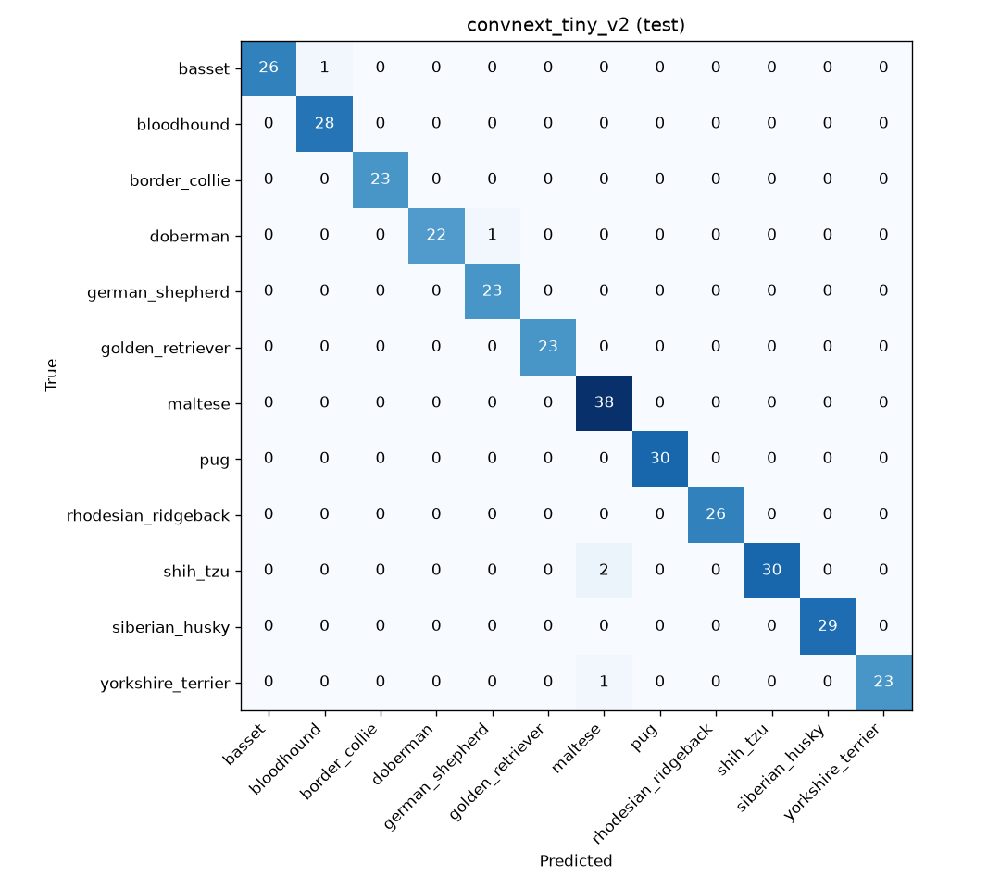
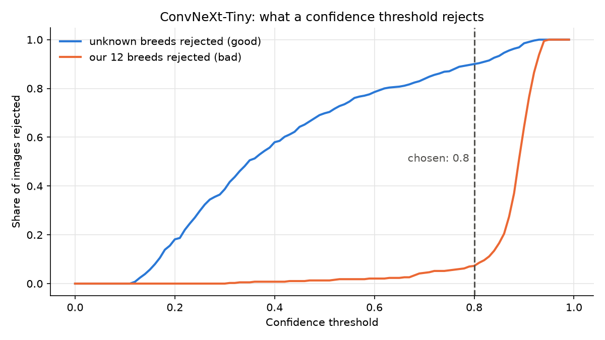

# Dog Breed Classifier V2

A CNN that identifies 12 dog breeds from a photo, rebuilt from a 2024 team project (v1) with transfer leraning, a fixed and documented dataset, and an honest evaluation.

**Final model: ConvNeXt-Tiny, 98.5% test accuracy and 59 / 60 on new photos it has never seen.**

**Live demo: [dog-breed-classifier-v2.streamlit.app](https://dog-breed-classifier-v2.streamlit.app/)**
(upload of paste a dog photo; below 80% confidence it answers "not sure." The free hosting sleeps when unused,
so the first visit can take a minute to wake up.)

## Results

| Model | Val | Test (326) | Test macro F1 | Fresh photos (60) |
|---|---|---|---|---|
| v1-style CNN from scratch | 31.6% | 30.1% | 0.28 | 31.7% |
| EfficientNet-B0 (ImageNet weights) | 94.4% | 96.3% | 0.96 | 93.3% |
| **ConvNeXt-Tiny (ImageNet weights)** | **98.8%** | **98.5%** | **0.99** | **98.3%** |



## Key findings

- **Transfer learning is the main takeaway.** The same data takes a from-scratch CNN to 30% and a pretrained ConvNeXt to 98.5%.
- **The remaining errors are the look-alike breeds:** Shih-Tzu / Maltese / Yorkshire Terrier and Basset / Bloodhound, the pairs flagged during data exploration.
- **ImageNet overlap.** Stanford Dogs comes from ImageNet, and ImageNet-1k contains all 12 breeds. A frozen ConvNeXt already reached 99% after one epoch. To check that the result isn't just memorisation, the final model was tested on 60 new photos (Unsplash, Pexels, Purina UK, none in Stanford Dogs, verified by perceptual-hash check): 59 / 60 correct.
- **Choosing the best epoch by val loss, not accuracy.** At 99% accuracy, epochs differ by a handful of images; selecting by accuracy picked a poorly calibrated checkpoint.
- **"Not one of these breeds".** The model always answers one of 12 breeds. Below a confidence of 0.8 it should be treated as "not sure": this rejects about 90% of dogs from 108 other breeds. See `notebooks/03_results.ipynb`.



## Data

All Stanford Dogs images of 12 breeds (2,158), fixed 70/15/15 stratified split in `data/splits.csv`.
Details, known issues and licence: [docs/data_card.md](docs/data_card.md).
Every decision and its reason: [docs/decisions.md](docs/decisions.md).

## Try the trained model

The trained weights (`best.pt`) are attached to the
[v1.0 release](https://github.com/LucaLiVigni27/dog-breed-classifier-v2/releases/tag/v1.0).

```bash
pip install -e ".[demo]"
python -m dogbreeds.inference --checkpoint best.pt --image my_dog.jpg
DOGBREEDS_CHECKPOINT=best.pt python -m streamlit run demo/streamlit_app.py
```

## Run the demo with Docker

```bash
docker build -t dog-breed-classifier .
docker run --rm -p 8501:8501 dog-breed-classifier
```

Then open http://localhost:8501. The container downloads the weights from the release on first
use. To use a local copy instead, mount it and point the app at it:

```bash
docker run --rm -p 8501:8501 \
  -v "$(pwd)/outputs/runs/convnext_tiny_v2:/weights:ro" \
  -e DOGBREEDS_CHECKPOINT=/weights/best.pt \
  dog-breed-classifier
```

## How to reproduce

```bash
pip install -e ".[dev]"
mkdir -p data/stanford_dogs
curl -L -o data/stanford_dogs/images.tar http://vision.stanford.edu/aditya86/ImageNetDogs/images.tar
tar -xf data/stanford_dogs/images.tar -C data/stanford_dogs
python -m dogbreeds.build_dataset

python -m dogbreeds.train --config configs/convnext_tiny.yaml       # GPU recommended (Colab T4: ~4 min)
python -m dogbreeds.evaluate --run outputs/runs/convnext_tiny
python -m dogbreeds.predict --run outputs/runs/convnext_tiny --images <folder of photos> --out predictions.csv
```

Training on Colab: see `notebooks/02_train_colab.ipynb`.

## Project structure

```
src/dogbreeds/   dataset building, split, training, evaluation,prediction
configs/         one YAML file per experiment
notebooks/       01 data exploration, 02 training on Colab, 03 results
demo/            Streamlit app and example photos (deployed on Streamlit Community Cloud)
Dockerfile       container for the demo
docs/            data card, decisions log, figures
tests/           pytest suite (runs on CPU with tiny fake images)
legacy/v1/       the surviving v1 data-loading script
```

## Limitations

- Only 12 breeds; mixed breeds and other animals are not handled.
- Test images come from the same source as training and the fresh-photo set is small (60).
- The 0.8 threshold was chosen on the same results it is reported on.
- Stanford Dogs / ImageNet images are for non-commercial research and education only.
